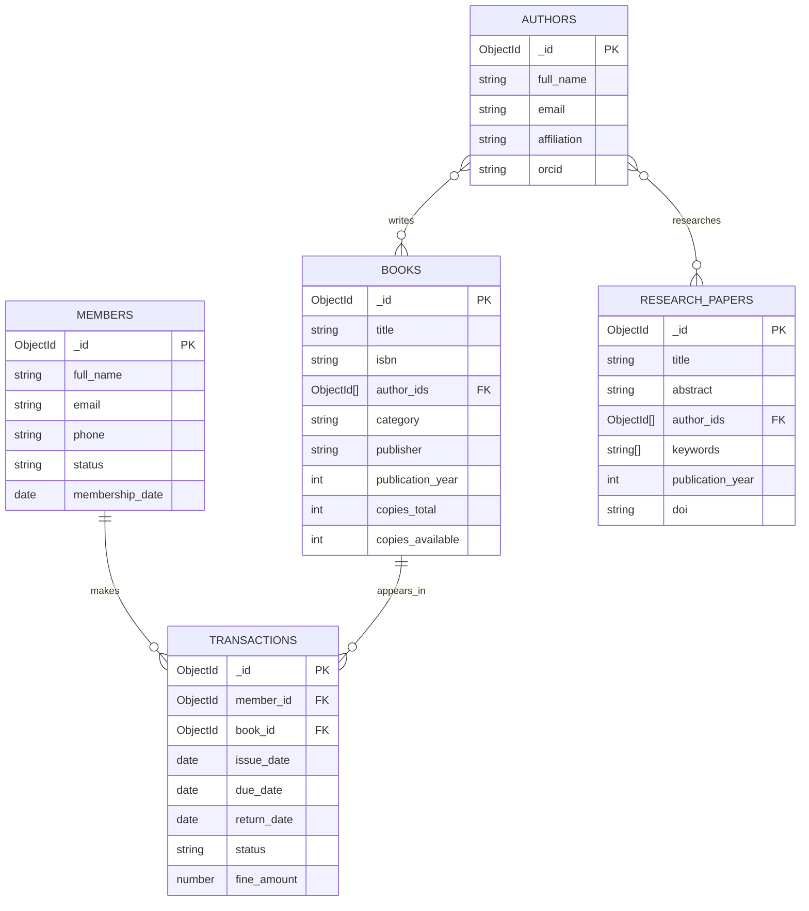

# Database Schema Design

```mermaid
erDiagram
    AUTHORS {
        ObjectId _id PK
        string full_name
        string email
        string affiliation
        string orcid
    }

    BOOKS {
        ObjectId _id PK
        string title
        string isbn
        ObjectId[] author_ids FK
        string category
        string publisher
        int publication_year
        int copies_total
        int copies_available
    }

    MEMBERS {
        ObjectId _id PK
        string full_name
        string email
        string phone
        string status
        date membership_date
    }

    TRANSACTIONS {
        ObjectId _id PK
        ObjectId member_id FK
        ObjectId book_id FK
        date issue_date
        date due_date
        date return_date
        string status
        number fine_amount
    }

    RESEARCH_PAPERS {
        ObjectId _id PK
        string title
        string abstract
        ObjectId[] author_ids FK
        string[] keywords
        int publication_year
        string doi
    }

    MEMBERS ||--o{ TRANSACTIONS : makes
    BOOKS ||--o{ TRANSACTIONS : appears_in
    AUTHORS }o--o{ BOOKS : writes
    AUTHORS }o--o{ RESEARCH_PAPERS : researches
```
