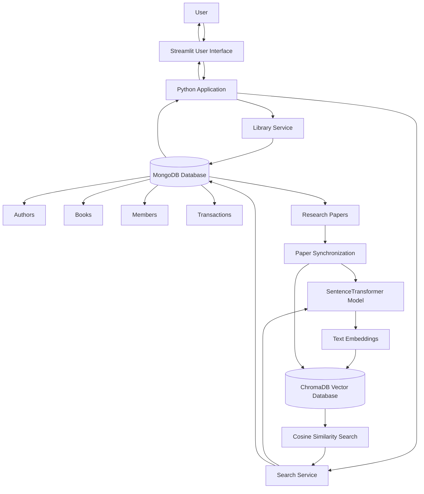

# Digital Library and Research Paper Finder
## System Architecture Diagram

```mermaid
flowchart TD
    U["User"] --> UI["Streamlit User Interface"]

    UI --> PY["Python Application"]

    PY --> LS["Library Service"]
    PY --> SS["Search Service"]

    LS --> MDB[("MongoDB Database")]

    MDB --> C1["Authors"]
    MDB --> C2["Books"]
    MDB --> C3["Members"]
    MDB --> C4["Transactions"]
    MDB --> C5["Research Papers"]

    SS --> ST["SentenceTransformer Model"]
    ST --> EMB["Text Embeddings"]
    EMB --> CH[("ChromaDB Vector Database")]

    C5 --> SYNC["Paper Synchronization"]
    SYNC --> ST
    SYNC --> CH

    CH --> SIM["Cosine Similarity Search"]
    SIM --> SS
    SS --> MDB
    MDB --> PY
    PY --> UI
    UI --> U
```
